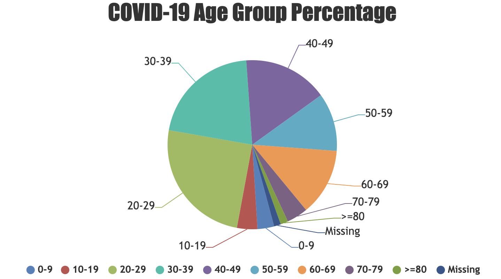
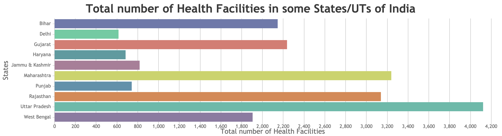
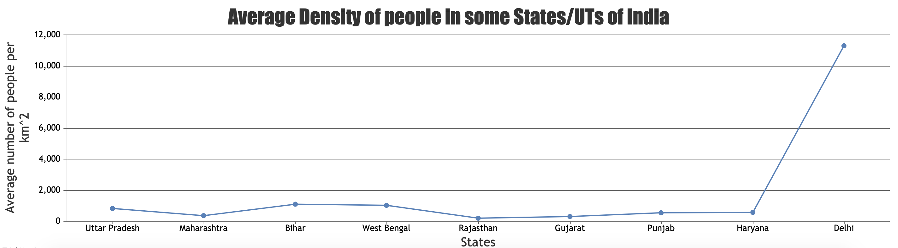

# COVID-19

This website provides some visualizations related to COVID-19 pandemic.

### REST API serving data used in the website

[COVID-19-REST-API](https://www.github.com/saran-shabd/COVID-19-REST-API)

## Screenshots







## Run locally using `yarn`

-   Run application:

    ```bash
    yarn start
    ```

-   Create Optimized Optimized Production build:

    ```bash
    yarn build
    ```

### Data Source

[https://www.kaggle.com/sudalairajkumar/covid19-in-india](https://www.kaggle.com/sudalairajkumar/covid19-in-india)

#### Note

_This project was created to be submitted as an assignment, and is not one of my personal projects._
